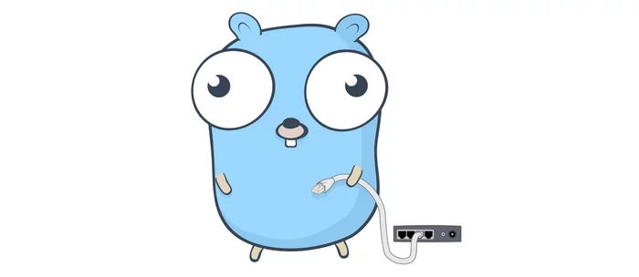
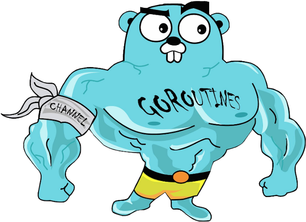

<!-- no toc --> 
# Start to Go

## Table of content

- [Start to Go](#start-to-go)
	- [Table of content](#table-of-content)
	- [What is Go](#what-is-go)
		- [Why is Go](#why-is-go)
		- [Who uses Go](#who-uses-go)
		- [Why use Go](#why-use-go)
		- [Go for other purposes](#go-for-other-purposes)
	- [Install Go](#install-go)
		- [Go Playground](#go-playground)
	- [Programming basics](#programming-basics)
		- [Entry point](#entry-point)
		- [Variables](#variables)
			- [Declaration and assignment](#declaration-and-assignment)
			- [Slices](#slices)
			- [Overview basic types](#overview-basic-types)
		- [Functions](#functions)
			- [Pointer vs values](#pointer-vs-values)
			- [Named return values](#named-return-values)
		- [Flow control](#flow-control)
			- [If/else](#ifelse)
			- [For](#for)
			- [While](#while)
			- [Switch](#switch)
			- [Goto](#goto)
			- [Defer](#defer)
	- [Custom types](#custom-types)
		- [Methodes](#methodes)
		- [Interfaces](#interfaces)
	- [Package management](#package-management)
		- [Importing packages](#importing-packages)
		- [Making your own packages](#making-your-own-packages)
	- [(Unit) Testing](#unit-testing)
		- [Structure](#structure)
		- [Example](#example)
	- [Project documentation](#project-documentation)
		- [Doc strings](#doc-strings)
		- [Package documentation (Go doc, go.dev)](#package-documentation-go-doc-godev)
	- [Interesting sources](#interesting-sources)

## What is Go

Go also known as Golang for searchability and domain (https://golang.org),  
is a statically typed, compiled programming language designed at Google by Robert Griesemeer (JS V8), Rob Pike(UTF-8, Acme, Unix, Plan 9) and Ken Thompson (B, UTF-8, Unix, Plan 9).

It's main focus is to be a language that makes it easy to build simple, reliable and efficient software.

Features:
- Open source
- Readable syntax (C-like)
- Static typing
- Garbage collection
- Builtin concurrency support
- Powerful standard library and tools
- Builtin support for testing and benchmarking
- Fast compile
- Easy cross platform compilation and development
- ...

### Why is Go

When Go was designed mostly Java, C++ and Python was used to write server software.

Java and C++ were fast but required a lot of bookkeeping and repetition, and some programmers switched to Python for a more dynamic and fluid language at cost of efficiency and type safety.

The designers felt it should be possible to have efficiency, the safety, and the fluidity in a single language.

Throughout its design, the designers have tried to reduce clutter and complexity. Everything needs to be declared just once. Initialization is expressive, automatic, and easy to use. Syntax is clean and light on keywords

Another important principle is to keep the concepts orthogonal. Methods can be implemented for any type; structures represent data while interfaces represent abstraction; and so on. Orthogonality makes it easier to understand what happens when things combine. 

### Who uses Go

- Google: As they developed it, it makes sense that they use the language throughout the company.
- Moby (opensource part of Docker) (https://github.com/moby)
- Kubernetes (https://github.com/kubernetes)
- Uber (https://github.com/uber)
- Twitch (https://github.com/twitchtv)
- Sendgrid (https://github.com/sendgrid)
- SoundCloud (https://github.com/soundcloud)
- American Express (https://github.com/americanexpress)
- PayPal (https://github.com/paypal)
- The New York Times (https://github.com/nytimes)
- Target (American retailer) (https://github.com/target)
- ...

 It is mostly used for server applications, (cloud) infrastructure tooling, cli applications and tools, ...

### Why use Go

For the mascot of course!

  



### Go for other purposes

Go is not only a language to write server backend code, it can also be used for embedded programming with the [TinyGo](https://tinygo.org/) compiler and has a WebAssembly target to be used in frontend, e.g: [Vecty](https://github.com/hexops/vecty), [Vugu](https://github.com/vugu/vugu), ...

## Install Go

https://go.dev/doc/install

When using an IDE make sure to also install the Go plugin if available.
The go team maintains the [`gopls`](https://github.com/golang/tools/tree/master/gopls) language server that implements the [Language Server Protocol (LSP)](https://microsoft.github.io/language-server-protocol/) that most popular IDEs support.


### Go Playground

Alternatively there is an online tool to play around with the Go language.
It has some limitations: no support for importing external packages, so only (most) of the standard library can be used, limited execution time and resource usage, ...

https://go.dev/play

## Programming basics

### Entry point

The compiler will look for the the function `main` (no args not return values) of package `main` to start running the program
```go
package main

func main(){}
```

To run Go code:
```sh
go run <filename>.go
```

Hello world example: https://go.dev/play/p/MAohLsrz7JQ

### Variables

#### Declaration and assignment

A variable can be declared by using the keyword `var` / `const` and can then be assigned with `=`

```go
var i int // By default this will be 0
i = 1
```

This can also be done in one line
```go
const int = 1
```

Even shorter, `:=` can be used to declare and assign at the same time
The type will be assumed from the value
```go
i := 1 // int
f := 1.0 // float64
s := "1" // string
```

Multiple variables can be declared and assigned in a single line
```go
i, j := "test", 1
```

#### Slices

To go a bit more into detail about working with arrays in Go.

Most of the time a `Slice` is used, which is an abstraction of an array that allow to have a flexible length array.
A `Slice` can be seen as a dynamic view on an array

```go
// Declaration of a fixed size array
var i [4]int

// Declaration of a dynamic size slice
var j []int

// Declaration of slice with make keyword
length := 4 // 
k = make([]int, length)

// // Declaration of slice with make keyword with capacity
capacity := 7 // size of the array being used under the hood
k = make([]int, length, capacity)


// Print length of array/slice
fmt.Println(len(k))

// Print capacity of array/slice 
fmt.Println(cap(k))
```

The capacity passed in the make command will not limit the amount of items being able to be put in the slice. It is used to set the length of the initial array so memory can be used a bit more efficiently as it provides control of the underlying array.

When using the `append` function to add another item to the slice and it would exceed the current capacity, it would increase capacity of the underlying array. (doubles up to 1024, afterwards capacity is increased with 1/4th of the current capacity)

https://go.dev/play/p/HKYTBlZIk7I


#### Overview basic types

bool

string

int  int8  int16  int32  int64
uint uint8 uint16 uint32 uint64 uintptr

byte // alias for uint8

rune // alias for int32
     // represents a Unicode code char

float32 float64

complex64 complex128


### Functions

Functions can be defined with the `func` keyword.
Arguments for the functions are defined by stating `name` and `type`. They are always named and are required to by passed when called
```go
func greet(name string) {
  fmt.Printf("Hello: %s!\n", name)
}
```

When the function returns a variable, the type needs to be added at the end of the signature:
```go
func create_greet_string(name string) string {
  return fmt.Sprintf("Hello: %s!", name)
}
```

It is possible to pass a variable amount of arguments, that can only be done as the argument and be of the same type.
This can be done with a `variadic` paramenter (... prefix).
`names` inside the function will be a slice of the defined type.

```go
package main

import (
	"fmt"
	"strings"
)

func main() {
  s := concat_names("hello world", "foo bar", "lorem ipsum")
  fmt.Println(s) // Hello World, Foo Bar, Lorem Ipsum
}

func concat_names(names ...string) string {
	names = capitalise_names(names...) // Explode into individual items
	return strings.Join(names, ", ")
}

func capitalise_names(names ...string) []string {
	for i, name := range names {
		names[i] = strings.Title(name)
	}
	return names
}
```

#### Pointer vs values

Variables in Go can be defined/passed as pointer or (a copy of) the value

Pointer type (*Type)
```go
var i *int
i = new(int) // Create a new int pointer that is not nil
```

Value of the pointer type (*variable)
```go
*i = 5
```

Get pointer of value (&variable)
```go
i := 5 // normal int
j := &i // pointer to i
```

Example:

```go
package main

import (
	"fmt"
)

func main() {
	i := 5

	setZeroValue(i)
	fmt.Println(i)

	setZeroPointer(&i)
	fmt.Println(i)
}

func setZeroPointer(i *int) {
	*i = 0
}

func setZeroValue(i int) {
	// Doesn't change the value in main as it's not a pointer
	i = 0
}
```

#### Named return values

Return values of a function/method can be named. A return without arguments will then return the named variables (naked return).

```go
// Note that when two or more consecutive named function parameters share a type,
// you can omit the type from all but the last. 
func split(num int) (x, y int) {
	x = num * 4 / 9
	y = num - x
	return
}
```

Personally not a fan, I find it acceptable for short functions, but can get confusing in longer functions.

### Flow control

#### If/else

If/else works just like many other languages

```go
i := 1
if i == 1 {
  fmt.Println("i is one.")
} else if i == 2 {
  fmt.Println("i is two.")
} else {
  fmt.Println("i is more than two.")
}
```

#### For

Basic for:
```go
sum := 0
for i := 0; i < 10; i++ {
  sum += i
}
fmt.Println(sum)

```

Range over slice:
```go
pow := []int{1, 2, 4, 8, 16, 32, 64, 128}
for i, v := range pow {
  fmt.Printf("Index %d = %d\n", i, v)
}

// Index can be ignored
for _, v := range pow {
  fmt.Printf("%d\n", v)
}
```

The `continue` and `break` keywords can be used for management of the flow inside the for
```go
pow := 0
for i := 0; i < 1000; i++ {
  if pow < 2 {
    pow++
    continue
  } else if pow > 1000 {
    break
  }
  pow = pow * pow
}

fmt.Println(pow)
```

#### While

There is no `while` keyword in Go. Instead the `for` keyword in used to do `while` operations in other languages.

```go
sum := 1
for sum < 1000 {
  sum += sum
}
fmt.Println(sum)

// Infinite loop
for {
  fmt.Println("Bird is the word!")
}
```

#### Switch

Switch cases evaluate cases from top to bottom, stopping when a case succeeds.

``` go
import (
	"fmt"
	"runtime"
)

func main() {
	fmt.Print("Go runs on ")
	switch os := runtime.GOOS; os {
	case "darwin":
		fmt.Println("OS X.")
	case "linux":
		fmt.Println("Linux.")
	default:
		fmt.Printf("%s.\n", os)
	}
}
```

The `switch` itself does not need a condition, making it an option to cleanly write long if/elses:
```go
import (
	"fmt"
	"time"
)

func main() {
	t := time.Now()
	switch {
	case t.Hour() < 12:
		fmt.Println("Good morning!")
	case t.Hour() < 17:
		fmt.Println("Good afternoon.")
	default:
		fmt.Println("Good evening.")
	}
}
```

A switch `case` only executes code inside of it's scope and does not execute cases underneath it. (No need to end the `case` with `break`)
If this is desired, `fallthrough` can be explicitly called at the end of the case.

```go
i := 45
switch {
case i < 10:
    fmt.Println("i is less than 10")
    fallthrough
case i < 50:
    fmt.Println("i is less than 50")
    fallthrough
case i < 100:
    fmt.Println("i is less than 100")
}
```

#### Goto

The `goto` keyword is used to jump to a label.
It is not used often as there are usually better and cleaner ways to implement this kind of logic,
but can come in handy for low(er) level programming for example.

```go
i := 0

LABEL:
i = i * 2

if i < 100 {
  i++
  goto LABEL
}
fmt.Println(i)
```

```go
var a int = 10

LOOP:
for a < 20 {
  if a == 15 {
    // skip the iteration
    a = a + 1
    goto LOOP
  }
  fmt.Printf("Value of a: %d\n", a)
  a++
}
```

#### Defer

The `defer` keyword waits with the execution of the function argument until the surrounding function returns.
Used often for cleanup.

A function can have multiple `defer`s, the last called `defer` will be executed first when the surrounding function returns.
```go
package main

import "fmt"

func main() {
	defer fmt.Println("Defer 1")
	defer fmt.Println("Defer 2")
	defer fmt.Println("Defer 3")
}
// Prints:
// Defer 3
// Defer 2
// Defer 1
```


## Custom types

Custom types in Go are defined as a `struct` which is a collection of fields.

```go
type Point struct {
  X int
  Y int
}

func main() {
	v := Point{1, 2}
	v.X = 4
	fmt.Println(v.X, v.Y)
  // Prints:
  // 4 2
}
```
https://go.dev/play/p/XpFqDP4cP6L

Note that capitalization matters here as lowercase structs and fields will not be accessible when called on from outside the package.

### Methodes

Methods can be attached to types defined within the package. To do this, simply add a receiver argument to a function.

As with types and functions, only capitalized methodes will be accessible from outside the package.

```go
type Point struct {
  X int
  Y int
}

func (v Point) String() string {
  return fmt.Sprintf("Coordinates are: X=%d, Y=%d", v.X, v.Y)
}

func main() {
	v := Point{1, 2}
	fmt.Println(v.String())
  // Prints:
  // Coordinates are: X=1, Y=2
}
```
https://go.dev/play/p/lv1aqS_nE2P

To be able to modify the type's fields from within the method, the type receiver needs to be of a pointer type.


```go
func (v *Point) Forward(steps int) {
  v.Y = v.Y + steps
}

func main() {
	v := Point{1, 2}
  v.Forward(5)
	fmt.Println(v.String())
  // Prints:
  // Coordinates are: X=1, Y=7
}
```
https://go.dev/play/p/AxPNGNbvYUX

It is good practice to keep the type receiver the same for all methodes of the type. e.g. all 


### Interfaces

To allow multiple types to be used as different implementations to operate on, `interface` types can be used as an abstraction.

An interface type is defined as a set of method signatures that define the behavior of the value. The value of an interface type can hold any value that implement those methodes.


```go
type CanGoForward interface {
	Forward(steps int)
}

type Point struct {
	X int
	Y int
}

func (v *Point) Forward(steps int) {
	v.Y = v.Y + steps
}

type FloatPoint struct {
	X float64
	Y float64
}

func (v *FloatPoint) Forward(steps int) {
	v.Y = v.Y + float64(steps)
}

func MoveForwards(point CanGoForward, steps int) {
	point.Forward(steps)
}

func main() {
	v := Point{1, 2}
	w := FloatPoint{3.0, 4.0}
	steps := 5

  // Note that we pass the pointer to the type as the implemented method is a pointer receiver
  // And if we mix the type receiver, it may be confusing what to pass as interface value
	MoveForwards(&v, steps)
	MoveForwards(&w, steps)

	fmt.Println(v.Y)
	fmt.Println(w.Y)
}
```
https://go.dev/play/p/Tok5ZEoqB3x

The value for the interface can be `nil`, if then the method is call on the `nil `interface, it will cause a run-time error. Therefor if a value cannot be guaranteed, a `nil` check may be needed.

If your method can take a value of any type, an empty interface can be used: `interface{}`. For example `fmt.Print` and `fmt.Println`  takes an empty interface, not necessarily a string.

## Package management

To split up go code into logical parts, it is possible to separate them into packages.

To be able to create and use packages within your project/module you can use the command `go mod init`

If the directory is a `git` repository, it will automatically generate project/module name.
If not, a custom name can be provived with `go mod init my_project`.

By convention the naming should be: `<git host domain>`/`<user/organisation name>`/`<project name>`.  
E.g: `github.com/chrisvdg/start-to-go`
If you want your project to be easily downloaded/installed via the Go tools, it is important to follow this convention.

---
**Note**
The naming is a URL within the Go environments and should not be seen as a web URL to the git repository of the project.

E.g.:   
Will work `go get github.com/pkg/errors`  
Does not work `go get https://github.com/pkg/errors`

---

### Importing packages

To use external packages to be used in the project, they first need to be installed locally before being able to be referenced.

Packages and it's documentation can be looked up on the go docs page: https://pkg.go.dev/

It can then be installed using the `go get <package>` command

```sh
# Import latest tag or master/main if no tag
go get github.com/pkg/errors

# Import specific version (git tag/branch/commit hash)
go get github.com/pkg/errors@v0.9.0

# Import package or get latest if already installed
go get -u github.com/pkg/errors
```

Then the package can be used used by importing it like:
```go
package main

import (
	// Direct package import (no git domain prefix etc.) are usually standard library
	"log"

  // Importing the installed package to this file
	"github.com/pkg/errors"
)

func main() {
	err := alwaysError()
	if err != nil {
		log.Fatal("Something went wrong: ", err)
	}
}

func alwaysError() error {
  // Use the imported package
	return errors.New("I always return an error")
}
```

If the package name can cause a collision or another name is required, it is possible to alias the imported package

```go
import errorPkg "github.com/pkg/errors"

func alwaysError() error {
	return errorPkg.New("I always return an error")
}
```

### Making your own packages

Creating your own packages is as simple as initiating your Go project as described above and pushed onto the master/main branch of that repo. If it's a pure library, there is no need for a `main.go` file and the package name should be the name of the repository and should not be `main`.

Keeping the same name will make the resource path and package name consistent

```go
import "github.com/pkg/errors"

// If the package name would be `pkgErrors` then this import would have to be used as:
func alwaysError() error {
	return pkgErrors.New("I always return an error")
}
// As the resource path and package name do not match, it makes it hard and confusing to know where the package was imported from
```

## (Unit) Testing

### Structure

Unit tests in Go are written in the same package (folder) as the code it's written in. They are written in separate files that end with `_test.go`. By convention it is prefixed by the filename where the code that's being tested resides in.  
E.g. functionality written in `calculations.go` has it's unit tests written in `calculations_test.go`.

For the package name of the file there are 2 options, either have the package name of the package you're working in, which will give you access to all private/unexported types, variables, constants, ...  
The other option is to use `<package_name>_test`. This will behave as another package where you import the package and run your tests on it's public functions and types.

The latter method is preferred as you test the code as it was a consumer of the code where it can be noticed if something is lacking or not feeling right in the package's API.  
If small pieces of very complex internal code needs to be tested, the first method can be used.

### Example

Say we have a folder within a project named `greeting` that contains a function returning a string dependent on the provided time.  
Within this folder we have 2 files, `greeting.go` containing the logic and `greeting_test.go` containing the unit tests.

Test themselves should start with `Test...`, they should be public for the test framework to be able to call them and only accept a variable of the pointer type `*testing.T` to conform to the test framework's interface.

greeting.go: 
```go
package greeting

import "time"

func Greet(t time.Time) string {
	switch {
	case t.Hour() < 12:
		return "Good morning!"
	case t.Hour() < 17:
		return "Good afternoon."
  case t.Hour() < 22:
    return "Good evening."
	default:
		return "Good night."
	}
}
```

greeting_test.go:
```go
package greeting_test

import (
	"<path_in_project>/greeting"
	"testing"
	"time"
)

// TestMorningGreeting tests 1 case of greeting that expects a morning response
func TestMorningGreeting(t *testing.T) {
	testTime, err := time.Parse("15:04:05", "11:00:00")
	if err != nil {
		t.Fatal("Failed to set up time for test")
	}
	want := "Good morning!"

	got := greeting.Greet(testTime)

	if want != got {
		t.Errorf("Expected '%s', but got '%s'", want, got)
	}
}

```

To run the test:
```sh
go test ./... # Run all the go tests in this directory and all the sub packages.
```

When testing multiple cases that can be executed by the same test, the table drive tests pattern can be used:
```go
func TestMorningGreetingTable(t *testing.T) {
	// test represents the input (and result data) needed for a single test case
	type test struct {
		timestamp  string
		timeFormat string
		want       string
	}

	// Declare the list of test cases and already populate it
	tests := []test{
		{
			timestamp:  "11:00:00",
			timeFormat: "15:04:05",
			want:       "Good morning!",
		},
		{
			timestamp:  "12:00:00",
			timeFormat: "15:04:05",
			want:       "Good afternoon.",
		},
		{
			timestamp:  "16:00:00",
			timeFormat: "15:04:05",
			want:       "Good afternoon.",
		},
		{
			timestamp:  "17:00:00",
			timeFormat: "15:04:05",
			want:       "Good evening.",
		},
	}

	for _, tc := range tests {
		testTime, err := time.Parse(tc.timeFormat, tc.timestamp)
		if err != nil {
			t.Fatal("Failed to set up time for test")
		}
		got := greeting.Greet(testTime)
		if tc.want != got {
			t.Errorf("Expected '%s', but got '%s'", tc.want, got)
		}
	}
}
```


## Project documentation

### Doc strings

Good reference documentation

### Package documentation (Go doc, go.dev)

Can provide higher level documentation to give context to the package and examples on how to use it.

## Interesting sources

- [Go main portal](https://go.dev)
- [Go tour](https://go.dev/tour)
- [Go blog](https://go.dev/blog/)
- [Gophercon Youtube](https://www.youtube.com/c/GopherAcademy)
- [Go time podcast](https://changelog.com/gotime)
- [JustForFunc youtube tutorials by Francesc Campoy](https://www.youtube.com/c/JustForFunc) (Note: no recent content)
