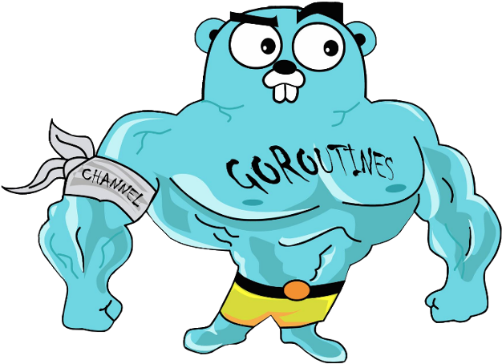

<!-- no toc --> 
# Go introduction

## Table of content

- [Go introduction](#go-introduction)
  - [Table of content](#table-of-content)
  - [What is Go](#what-is-go)
    - [Why is Go](#why-is-go)
    - [Who uses Go](#who-uses-go)
    - [Why use Go](#why-use-go)
    - [Go for other purposes](#go-for-other-purposes)
  - [Install Go](#install-go)
  - [Programming basics](#programming-basics)
    - [Entry point](#entry-point)
    - [Variables](#variables)
      - [Declaration and assignment](#declaration-and-assignment)
      - [Pointer vs reference](#pointer-vs-reference)
    - [Functions](#functions)
    - [Keywords](#keywords)
    - [Standard types](#standard-types)
  - [Structs](#structs)
    - ['Classes'](#classes)
    - [Methodes](#methodes)
    - [Interfaces](#interfaces)
  - [Exercise basic](#exercise-basic)
  - [Importing libs](#importing-libs)
    - [Go get](#go-get)
    - [Import](#import)
    - [Library documentation (Go doc, go.dev)](#library-documentation-go-doc-godev)
    - [Dependency management](#dependency-management)
    - [Vendor](#vendor)
    - [Go mod basics](#go-mod-basics)
  - [Exercise reading file](#exercise-reading-file)
  - [Webserver with std library](#webserver-with-std-library)
  - [Webserver with Gorilla mux](#webserver-with-gorilla-mux)
  - [Exercise web server](#exercise-web-server)
  - [Concurrency](#concurrency)
    - [Go keyword](#go-keyword)
    - [Sync](#sync)
    - [Channels](#channels)
  - [Exercise concurrency](#exercise-concurrency)
  - [Interesting sources of information](#interesting-sources-of-information)

## What is Go

Go also known as Golang for searchability and domain (https://golang.org),  
is a statically typed, compiled programming language designed at Google by Robert Griesemeer (JS V8), Rob Pike(UTF-8, Acme, Unix, Plan 9) and Ken Thompson (B, UTF-8, Unix, Plan 9).

It's main focus is to be a language that makes it easy to build simple, reliable and efficient software.

Features:
- Open source
- Readable syntax (C-like)
- Static typing
- Garbage collection
- Builtin concurrency support
- Powerful standard library and tools
- Builtin support for testing and benchmarking
- Fast compile
- Easy cross platform compilation and development
- ...

### Why is Go

When Go was designed mostly Java, C++ and Python was used to write server software.

Java and C++ were fast but required a lot of bookkeeping and repetition, and some programmers switched to Python for a more dynamic and fluid language at cost of efficiency and type safety.

The designers felt it should be possible to have efficiency, the safety, and the fluidity in a single language.

Throughout its design, the designers have tried to reduce clutter and complexity. Everything needs to be declared just once. Initialization is expressive, automatic, and easy to use. Syntax is clean and light on keywords

Another important principle is to keep the concepts orthogonal. Methods can be implemented for any type; structures represent data while interfaces represent abstraction; and so on. Orthogonality makes it easier to understand what happens when things combine. 

### Who uses Go

- Google: As they developed it, it makes sense that they use the language throughout the company.
- Moby (opensource part of Docker) (https://github.com/moby)
- Kubernetes (https://github.com/kubernetes)
- Uber (https://github.com/uber)
- Twitch (https://github.com/twitchtv)
- Sendgrid (https://github.com/sendgrid)
- SoundCloud (https://github.com/soundcloud)
- American Express (https://github.com/americanexpress)
- PayPal (https://github.com/paypal)
- The New York Times (https://github.com/nytimes)
- Target (American retailer) (https://github.com/target)
- ...

 It is mostly used for server applications, (cloud) infrastructure tooling, cli applications and tools, ...

### Why use Go

For the mascot of course!

  

### Go for other purposes

Go is not only a language to write server backend code, it can also be used for embedded programming with the [TinyGo](https://tinygo.org/) compiler and has a WebAssembly target to be used in frontend.

## Install Go

https://go.dev/doc/install

## Programming basics

### Entry point

### Variables

#### Declaration and assignment

#### Pointer vs reference

### Functions

### Keywords

### Standard types

## Structs

### 'Classes'

### Methodes

### Interfaces

## Exercise basic

## Importing libs

### Go get

### Import

### Library documentation (Go doc, go.dev)

### Dependency management

### Vendor

### Go mod basics

## Exercise reading file

## Webserver with std library

## Webserver with Gorilla mux

## Exercise web server

## Concurrency

### Go keyword

### Sync

### Channels

## Exercise concurrency

## Interesting sources of information

- [Go blog](https://go.dev/blog/)
- [Go time podcast](https://changelog.com/gotime)
- [Gophercon Youtube](https://www.youtube.com/c/GopherAcademy)
- [JustForFunc youtube tutorials by Francesc Campoy](https://www.youtube.com/c/JustForFunc)
